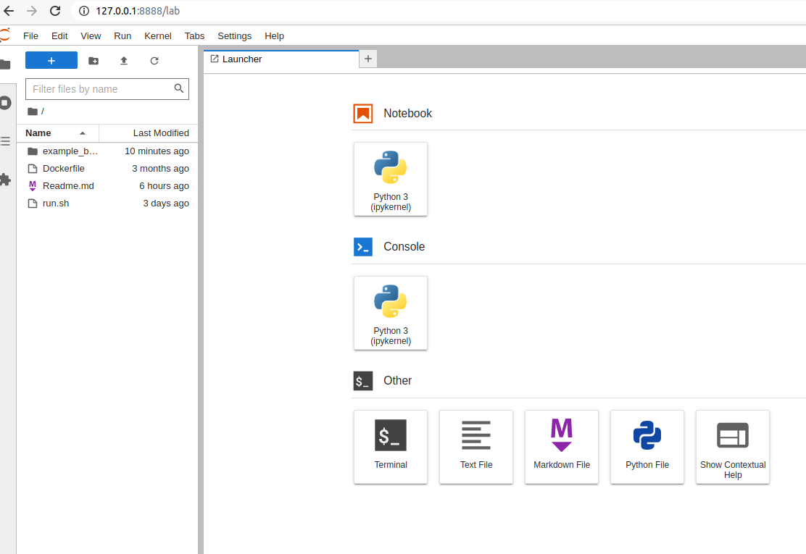
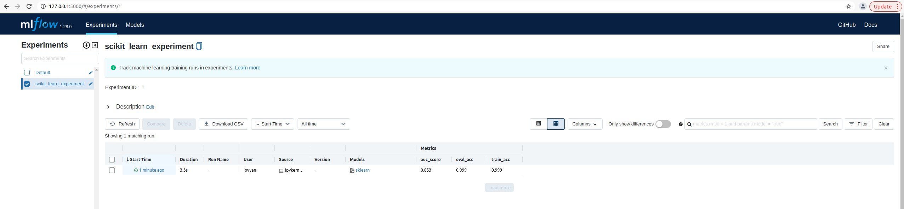

# Description

This code is based on one example used in the book "Beginning MLOps with MLFlow".
This book although very easy to read has one main fault: It does not provide a repository where its example code can be found. Another fault is that it list a list of requirements but leaves you with the task to create your own environments before attempting to *type* the lines which is time consumming. 

I have here put everything necessary to run the first example of the book in order that we spend more time understanding what MLFlow is rather than building an environment and typing lines.

# Procedure

## Running an experiment

First after cloning this repo, you have to get the data. In order to get the data go to [the data set in Kaggle](https:://www.kagle.com/mlg-ulb/creditcardfraud) and download the dataset by clicking the Download button next to New Notebook.(It might be necessary to sign in). Put the data file `creditcar.csv` in the `data` folder. 


Now go to the terminal and do

```
./run.sh
```

This will immediately start a Jupyter server. You can then go the http link that it indicates (usually it starts with `http:://127.0.0.1:8888/lab` ) in your browser where you can see the directory structure and the notebook we are going to use which is `exp2.ipynb` (inside the `example_book` folder)



Open the notebook and run this code until the cell 18. 
After that you will run cell 19 

```
sk_model= LogisticRegression(random_state=None, max_iter=400, solver='newton-cg')
mlflow.set_experiment("scikit_learn_experiment")
with mlflow.start_run():
    train(sk_model,x_train,y_train)
    evaluate(sk_model,x_test,y_test)
    mlflow.sklearn.log_model(sk_model,"log_reg_model")
    print("Model run: ",mlflow.active_run().info.run_uuid)
mlflow.end_run()
```
which will make sklearn set the experiment name, logs models and metrics etc.

## Time to see what MLFlow did

Later from another terminal do

```
docker ps
```
and see what is the name of the container we are running.
With that do
```
docker exec -it <name of container>  bash
```

NOTE: An alternative to this, is actually click the terminal in the above jupyter environment. With that you will have a terminal inside your container.


Now you are inside the container so you can go to the folder where a newly created `mlruns` directory is (`example_book`) and do

```
mlfow ui
```
Then go with the browser to `http://127.0.0.1:5000` where you will have the mlflow page



You can see that the experiment has been run once. 
If you run the cell 19 again, other experiments will be reflected there

Also notice that the artifacts are logged too. Have fun exploring the MLFlow UI page!


## Serving a model

In the jupyter notebook `local_serving.ipynb` we start serving a model

We go to the terminal inside the jupyter environment and from the folder that contains mlruns we do

```
mlflow models serve --model-uri runs:/<MODELRUN>/<MODELNAME> -p 1235
```

For example in this case

```
mlflow models serve --model-uri runs:/5c26f4ae1a284ccfa36e1f4017a361e4/log_reg_model -p 1235
```

Once you do that you can start running the cells of the notebook.


